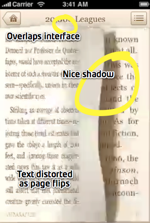
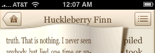
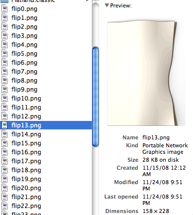
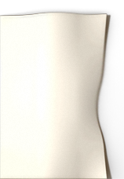

Last week, in <a href="http://darknoon.com/blog/2008/11/26/peeking-into-iphone-apps/">Peeking Into iPhone Apps</a>, I talked about the process by which the contents of an App bundle can be read and deciphered. In this post, I'm going to take a look at one application in particular: <a href="http://www.classicsapp.com/">Classics</a>.

While there have been blog posts about <a href="http://blog.cocoia.com/2008/10/23/designing-classics/">designing Classics</a>, I wanted to know about its implementation, so I did a little research.

<!--more-->

When I first saw the video on the Classics website, I was stunned. Here's a frame from their demo video:

Screen capture from the intro video on Classics. Comments are mine.

The 3d effect that accompanies turning a page is a new effect unlike anything I'd seen from a 3rd party developer. The text on the page seemed to be written on a 3d-object that bent and distorted as you turned the page, simultaneously causing a soft shadow to be cast on the page below. Wow.

It seemed like it would require a lot of work, perhaps making the page a 3d object and distorting it à la the built-in "Map Curl" effect (present but hidden in the 3rd-party accessible frameworks). I began to think about how I'd implement such an effect.

To get the page ripple effect, throw in some OpenGL ES, code some mesh distortion animation, and figure out how to blend it with the rest of the interface without hurting performance. Hmm…

...then, there's the difficulty of getting an image from text on the phone. The frameworks are pretty tricky in this regard. The main pathway for text rendering on the iPhone is WebKit. But you can't easily(<a href="#renderingWebKitToImage">1</a>) get an image from a WebKit view, and you can't insert a WebKit view into an OpenGL texture.

When I finally got a chance to download the App, I was overall very happy with it, though I had to turn off the page-turning sound immediately. This isn't a review, though, so _moving along_, I'll skip to a closer examination of the page-flip effect.

Taking a closer look, some things become clearer

When the page is flipping, it has a soft appearance that looks very fishy. Hmm. Then it hit me: they're cheating! Caught them in un-wholesome, outright cheating. No 3d-rendering, OpenGL, or any of that monkey business. Just a pre-rendered sequence of images. Oh, and the text isn't even being transformed in 3d; it's just a simple horizontal scaling, that, in combination with animated background, gives the impression that the entire page is being distorted.

That still leaves the mystery of text rendering, and for that, we'll have to delve into the application bundle. Using the technique from my last post, I opened the bundle and converted all of the PNGs.

The flip animation PNGs, in all of their glory

Ah-ha, so that confirms our suspicion about the flip animation being just a sequence of images. One thing that annoys me about the animation is confirmed in the image. There is significant color banding that can be quite distracting. By opening the PNG, we can see that this is not due to the iPhone's screen, but due to the original image. I adjusted the image of one frame to remove this issue by blurring the center of the image and adding some slight noise.

 vs 

However, lest you think that the authors of Classics are just trying to screw with your designer sense, I did notice that the adjusted image compressed to 40KB with `pngcrush -iphone` vs. ~20KB for the original file. Thus, it's possible that the effect wouldn't have worked with larger images. Nonetheless, a little noise can go a long way in terms of obscuring color banding. The softness in the images is coming from their size being reduced, presumably to conserve processor power and memory bandwidth.

Now, let's figure out how Classics is doing its text rendering. Note the .classic folders which seem to contain the books themselves. When we open them up, they're full of...

Holy Adobe!

Yup, those are PDFs. So that explains how they got the image to do the animation. Unlike the HTML/WebKit rendering on the iPhone, there _does_ exist a simple way to get an image from a PDF page. Also, they get lots of typographic control. Metadata says they were created by <a href="http://www.phillryu.com/">Phillip Ryu</a> in Pages.

The Info.plist file just encodes information like the title and the names of the chapters in the book. Well, that's about all that's interesting in the App bundle.

(1) Okay, so I did find a way to do it, but it's not pretty. You can poke around in the sublayers of a UIWebKitView and find some that have useful CGImages as contents, but it makes a lot of assumptions about the internals of the frameworks and thus could break in the future.

