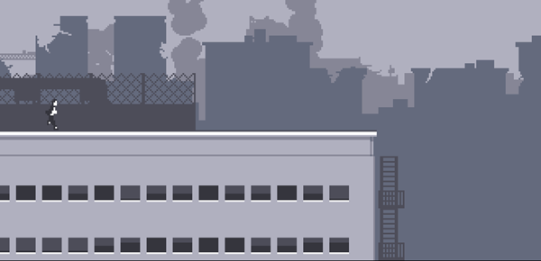
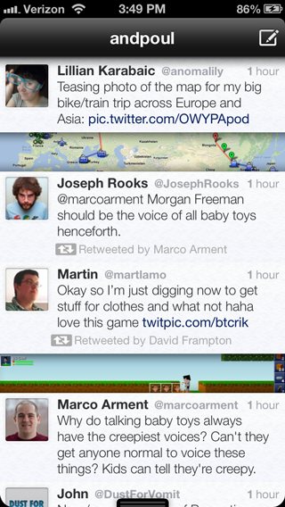
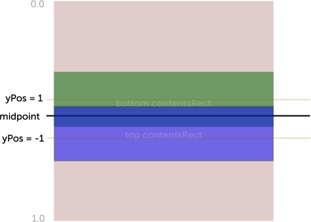
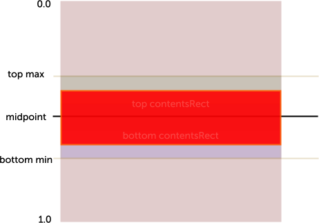
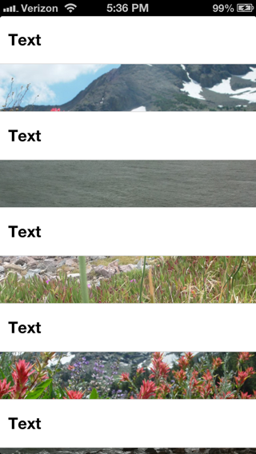

What is parallax scrolling?

Parallax scrolling is a technique typically found in side-scroller video games where as the character moves horizontally, the background moves at a slower pace, giving a sense of 3d-depth. This was an important technique to use before the advent of 3d games and graphics acceleration, but it's also an aesthetic choice in such games as [Cannabalt](http://www.adamatomic.com/canabalt/) .



So, how can we use this in a user interface? One way, used in [Twittelator Neue](https://itunes.apple.com/us/app/twittelator-neue/id469270564?mt=8) (made by my friends Ollie and Andrew Stone), is where an image inside a box gains an illusion of depth when you scroll vertically.

Notice the slightly different crop on the map below?




How might we implement this? Well, what we want is to change the crop of the image depending on the vertical scroll position as so:



Let's just assume we're working with a square image to simplify the calculations. A real implementation would have to deal with images of different aspect ratios.

We're going to use the `contentsRect` property of the layer displaying the image to crop it efficiently. We could have put a larger image inside a parent layer with `clipsToBounds` on, but this approach is more efficient for CoreAnimation to render on the GPU, as it only needs to adjust texture coordinates instead of doing something like changing the `glViewPort()` to only render into the correct box.

So, since `contentsRect` is measured in an abstract coordinates, we want to generate a `CGRect` whose origin and size lie within the unit box `(CGRect){0,0,1,1}`, representing some crop within the square image of unknown dimensions.



If we take `k` to be the parallax ratio, ie the ratio of apparent movement in the image vs amount of scrolling, we can arrive at a calculation for the correct `contentsRect`.

```objc
float offset = <y position of cell in frame of scroll view>
float totalHeight = tableView.frame.size.height;
float yPos = 2.0 * (offset / totalHeight - 0.5); //normalized y-position (-1 to 1)
float k = 0.7f; //parallax ratio
float w = self.bounds.size.width;
float h = self.bounds.size.height;

// We want the center of the crop to be at 0.5 when yPos = 0,
// and seem to move vertically by (k - 1.0) * contentSize.height pixels at each extreme.
// w in pixels equates to 1.0 vertically in contentRect because the image is square

float center = 0.5 - (k - 1.0) * 0.5 * totalHeight/w * yPos;

layer.contentsRect = (CGRect){
	.origin.x = 0.0,
	.origin.y = center - 0.5 * h/w,
	.size.width = w/w,
	.size.height = h/w,
};
```

One thing to note is that because we are in a `UIScrollView`, instead of moving the image up at 'k _ offset' and ourselves at `1.0 _ offset`, we should move the image down inside our box at`(k - 1.0) \* offset` to compensate for the motion of the scrollview contents.

Final result (kinda have to try it to see the effect):




You can [fork the code on GitHub](https://github.com/darknoon/ParallaxScrollView) if you want to add support for non-square images, etc.

```

```
