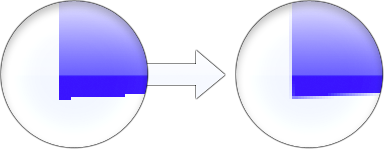
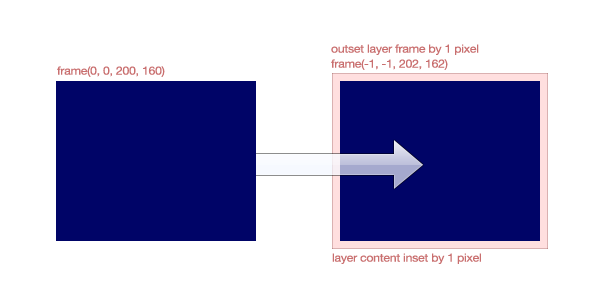

CoreAnimation is fast. Everything in a UIView is rendered to the screen via CALayers. Most of the time, you use it to composite rectangular images to the screen aligned to pixel boundaries and it's fast and looks great.

But, if you put a transform on a layer with content all the way to the edge, all of your nice pixel-perfect interface design gets messed uThe transformed layer doesn't look like the Photoshop / Illustrator / CoreGraphics version because of all of these jaggies.

While less noticeable on Retina displays, jaggies still look gross. Smooth the look of your interface during an animation or interaction that has a 2D rotation or a 3D transform with the Transparent Border Trick.

Hover to see with or without a transparent border hack:

By adding a transparent border around the content of your CALayers, you can use the built-in bilinear filtering of CoreAnimation to reduce the jaggies.

To understand how this works, let's contrast how CoreGraphics renders with CoreAnimation. CoreGraphics, as a CPU-based API, has a lot of flexibility in how it renders. By default, it's shooting for quality over speed so it picks a pretty anti-aliasing algorithm to make the edges of shapes smooth. This can be disabled with the `CGContextSetShouldAntialias()` function, but if you're using CoreGraphics it's usually for quality or complexity over speed anyway.

###Wouldn't it be better if we just antialiased all CoreAnimation content?

CoreAnimation uses the GPU, which brings with it a different set of constraints. Everything[1] rendered with OpenGL is composed of triangles, rendered via an optimized pipeline. This pipeline does not come with antialising (supersampling) turned on by default. If you're rendering directly in OpenGL ES on recent iOS devices, you can render to a larger buffer than the screen (4 rendered pixels per output pixel) and then shrink it down by "resolving" this larger buffer into a regular framebuffer. The problem is that rendering to a buffer 4x the screen size (super-sampled anti-aliasing) is rather slow and consumes a lot of power and memory so the battery life goes down. There are some shortcuts taken like only sampling textures / running shaders once per output pixel (multi-sampled anti-aliasing), but it's always a trade-off. Thus, Apple has chosen not to use supersampling in CoreAnimation, choosing efficency over render quality.

So, uh, what's [bi-linear filtering](http://en.wikipedia.org/wiki/Bilinear)\_filtering ?

The trick here is that instead of directly accounting for the edge of the layer, we're going to sample multiple pixels from the content on the inside of a larger layer. You have more than one pixel sampled when the point you're sampling from doesn't lie exactly on the pixel center of one of the pixels in the image.

So, when the layer is transformed, it will sample some from the transparent border and some from the inside content, depending on how far the current pixel is along the edge of the two, lending a smoother appearance to the edge. This breaks down if the on-screen points for the inside and outside of the layer contents are too far apart.

If you're still confused, check out this [github repo](https://github.com/darknoon/TransparentBorderTrick) with an example.

By the way, there is an implementation of `-[UIImage transparentBorderImage:]` in a [blog post on vocaro.com](http://vocaro.com/trevor/blog/category/mac/) that might be helpful if you have an existing image of the content you want transformed.

###Further notes

Since this trick exploits interpolation on the GPU during texture sampling, it can also be used when you're drawing content with OpenGL ES directly. The application to quads is obvious, but there are ways to extend this to other shapes with carefully constructed vertex attributes or textures.

Happy hacking!

fn1. Ok, technically you can use lines or points to render, but this is quite rare and probably what you want unless you're making a particle system.
