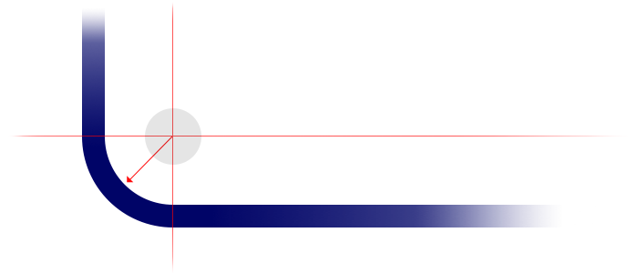
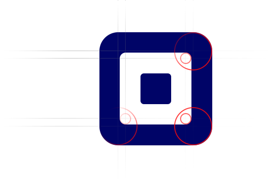

This is a [great tutorial](http://webdesign.tutsplus.com/tutorials/visuals/quick-tip-rounded-corners-done-right/) on how and why to match the corner radii in your designs. This is an easiest way to sharpen up your design, like having your shirt tucked in when wearing a suit jacket.

Of course, if you're Kanye West or something, you can get away with not tucking your shirt in. In this case, the [Square](http://square.com) logo shows us how to break the rules in style:

