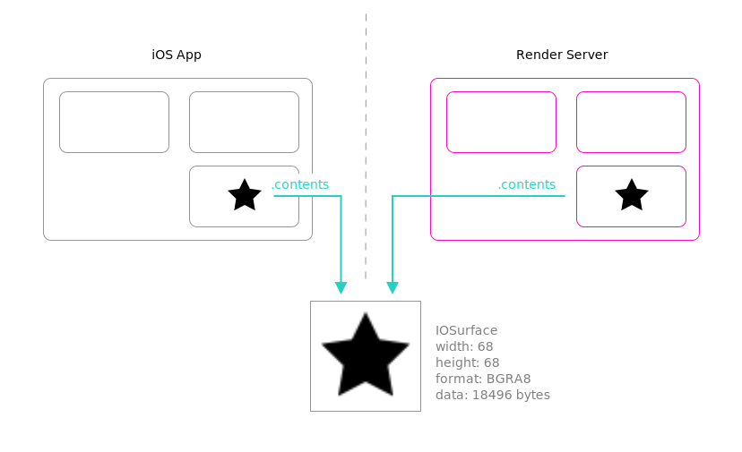
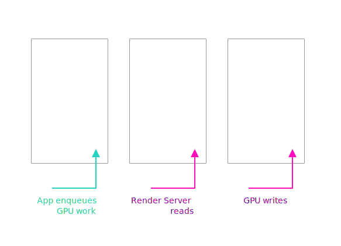
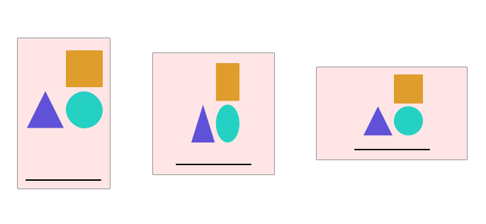
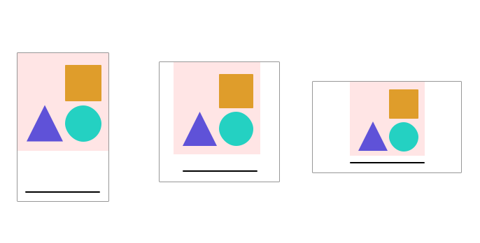

## How display works on iOS

A quick overview of the display pipeline on iOS:

- App uses UIKit to build its UI out of UIViews
- UIKit creates CoreAnimation layers for each view
- CoreAnimation layers are serialized and sent to render server process when the app commits the current `CATransaction` (or automatically after processing an event)
  - Layer properties like color, corner radius, transform, are serialized
  - Animations are serialized for execution in the render server
  - Layers with content like images, drawing, etc, use **shared memory** to provide content to render server
- The render server renders its copy of the CALayer hierarchy using Metal to the display's buffer at the appropriate time



Shared memory between render server process and app process is necessary because the isolation between processes prevents the iOS App from reading or writing to memory controlled by the other process. Mechanisms vary, but typically the app will create an `IOSurface` object that encapsulates both the shared memory and metadata like the pixel format. More on that in a moment.

## Displaying Metal content

[Metal](https://developer.apple.com/metal/sample-code/) is a low-level API for efficient display and compute using the GPU (similar in scope to OpenGL, DirectX, or Vulkan, WebGL).

Usually, the goal with Metal is to update the content at the display's native rate, typically, 60hz. It is therefore imperative that Metal content has an efficient pipeline for display.

The user API for metal is a [`CAMetalLayer`](https://developer.apple.com/documentation/quartzcore/cametallayer), or a higher-level wrapper like [`MTKView`](https://developer.apple.com/documentation/metalkit/mtkview) that wraps this layer class.

Internally, CAMetalLayer creates a triple-buffered IOSurface in the requested format and sets it as the `.contents` of its `CALayer`.



### Textures

Textures are a GPU abstraction for a buffer of memory representing an image, similar to IOSurfaces, but with more complex rules about sharing between CPU and GPU. They are typically not shared between processes.

During processing of data, Metal has a [variety of texture formats](https://developer.apple.com/documentation/metal/mtlpixelformat) available

### Displaying Textures

Often, the result of metal rendering or compute is a metal texture, but there is not a direct way to display a texture on screen in iOS. A simple shader that copies the texture data into the display output is a reasonable approach.

However, there is a catch. It is not easy to change the size at which you render your metal content. For example, during rotation the app is often changing its dimensions and the portion of the screen available to render in may change.

If the `MTKView` is in the default `autoResizeDrawable=true` mode , when the view resizes there will be an awkward stretching as the backing store of the view (triple-buffered metal texture) is resized to the new size, then UIKit animates the change of view to the new size.



To avoid this glitch, we can draw directly to the IOSurface-backed Metal texture that's going to be displayed in the view



Theoretically, you could make the Metal view just the right size to display in portrait or landscape, and try to adjust for the rotation each frame. However, it is hard get the rotation that the view will be in at the next frame and it causes a lot of drawing activity.

## IOSurfaces

IOSurfaces have a long history on macOS and iOS, but were only made public api in iOS 10.0 with the Obj-C interface `IOSurface` or its C equivalent `IOSurfaceRef`.

Let's see how we can create one:

```objc
size_t bytesPerPixel = 4;
IOSurface *surface =
[[IOSurface alloc] initWithProperties:
    @{
    IOSurfacePropertyKeyWidth: @(width),
    IOSurfacePropertyKeyHeight: @(height),
    IOSurfacePropertyKeyBytesPerElement: @(bytesPerPixel),
    IOSurfacePropertyKeyPixelFormat: [NSNumber numberWithInt:'BGRA'],
    IOSurfaceBytesPerRow: @(bytesPerPixel * width),
    }];
```

Now how do we display this surface on screen?

Well, it turns out there are two easy ways:

1. Set it directly as the contents the layer of a view

```objc
view.layer.contents = (__bridge id)surface;
```

2. Set a `UIImageView`'s `.image` to a `CIImage` created with the `IOSurface`:

```objc
CIImage *renderedImage = [CIImage imageWithIOSurface:(__bridge IOSurfaceRef)surface options:@{}];
imageView.image = [UIImage imageWithCIImage:renderedImage];
```
