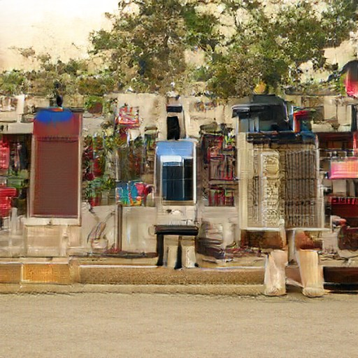

I started off in this direction because I was really interested in the abstract yet image-like output of BigGAN[^1]. You can see it in action over on [Artbreeder](https://artbreeder.com/), where it's called the "General" model.

However the small output size prevented it from being that interesting, so I wanted to see what I could do to "hack" it to output larger images (perhaps explaining something about how GANs generators work along the way).

In this post, I'll describe my process for generating weird images like this:


Since BigGAN already doesn't output realistic images, I was more concerned with making interesting images than improving image quality.

We're going to take the pretrained model (specifically the Generator, discarding the descriminator) of the BigGAN model and do something bit like [circuit-bending](https://en.wikipedia.org/wiki/Circuit_bending), modifying the code that produces an image **without** retraining the network (which is infeasible since the training data is proprietary to Google).

To more easily facilitate modification of the model, we're going to use the [PyTorch version](https://github.com/huggingface/pytorch-pretrained-BigGAN) provided by Huggingface.

The first step towards creating a larger image is finding a place within the model where we can replace a lower-resolution feature map with a higher-res map (hopefully subsequent layers will perform roughly the same function as before).

The general structure of BigGAN is as follows (assume 1 image is being generated):

1. Inputs

- **Class** [1, 1000][^2] one-hot vector indicating class,
  this vector is first embedded to a 128-dimensional space

  For example, [0, 0, 1, 0, 0, 0, …] would correspond to class of _great white shark_

  Nothing forces this vector to actually be one-hot (ie, have only one entry with a 1 and the rest 0), in fact most of the interesting images on Artbreeder are formed by a weird combination of partial classes.

  For example, [this image](https://artbreeder.com/i?k=adf8ce01ceb55400ca688aa0) is 20% greenhouse, 18% web site, 15% band-aid, 11% nipple, 7% cell phone, etc.
  

  During training, this vector is always one class only, so in-between images can be very glitchy!

- **Z** [1, 128] noise vector

  By varying this vector, you explore all of the different outputs associated with this class (or combination of classes)

2. **Mapping** [1, 256] -> [1, 32768] -reshape-> [1, 4, 4, 128] <br />
   Convert the condition vector into an image (it will also be fed into the residual blacks)

   The mapping network takes the 256 vector and outputs a vector of 32768 numbers. Then this is interpreted as a 4x4 image with 128 channels.

1. **Residual Blocks** This is where the bulk of the convolution goes in the network. Each block is applied in sequence and has its own learned parameters.

1. **Non-Local Block** This is an "attention" mechanism to ensure that information propagates across the whole image

1. **More Residual Blocks** Same as above

Here is the PyTorch function for hacking, cribbed from the [`BigGAN.forward(…)`](https://github.com/huggingface/pytorch-pretrained-BigGAN/blob/1e18aed2dff75db51428f13b940c38b923eb4a3d/pytorch_pretrained_biggan/model.py#L289) and [`Generator.forward(...)`](https://github.com/huggingface/pytorch-pretrained-BigGAN/blob/1e18aed2dff75db51428f13b940c38b923eb4a3d/pytorch_pretrained_biggan/model.py#L228) ) where you can see everything at a high level.

```py
model = BigGAN.from_pretrained('biggan-deep-512')

def gen(noise_vector, class_vector, truncation):
  embed = model.embeddings(class_vector)
  cond_vector = torch.cat((noise_vector, embed), dim=1)

  gen = model.generator

  z = gen.gen_z(cond_vector)

  # Not shown: conversion to account for using Tensorflow weights instead of PyTorch weights

  for i, layer in enumerate(gen.layers):
    if isinstance(layer, GenBlock):
      # Residual block
      z = layer(z, cond_vector, truncation)
    else:
        # This is the self-attention layer
        z = layer(z)

  # Batch norm layer
  z = gen.bn(z, truncation)
  z = gen.relu(z)
  # Final convolution
  z = gen.conv_to_rgb(z)
  # For some reason TensorFlow weights output 8 channels instead of 3
  z = z[:, :3, ...]
  # Final activation
  z = gen.tanh(z)

  return z
```

Instead of calling the normal forward

[^1]: 2018 A Brock, J Donahue, K Simonyan BigGAN [arXiv preprint](https://arxiv.org/abs/1809.11096) [Notebook](https://colab.research.google.com/github/tensorflow/hub/blob/master/

examples/colab/biggan_generation_with_tf_hub.ipynb)

[^2]: Note: [a, b, c] denotes the shape of the multi-dimensional array aka "Tensor"
