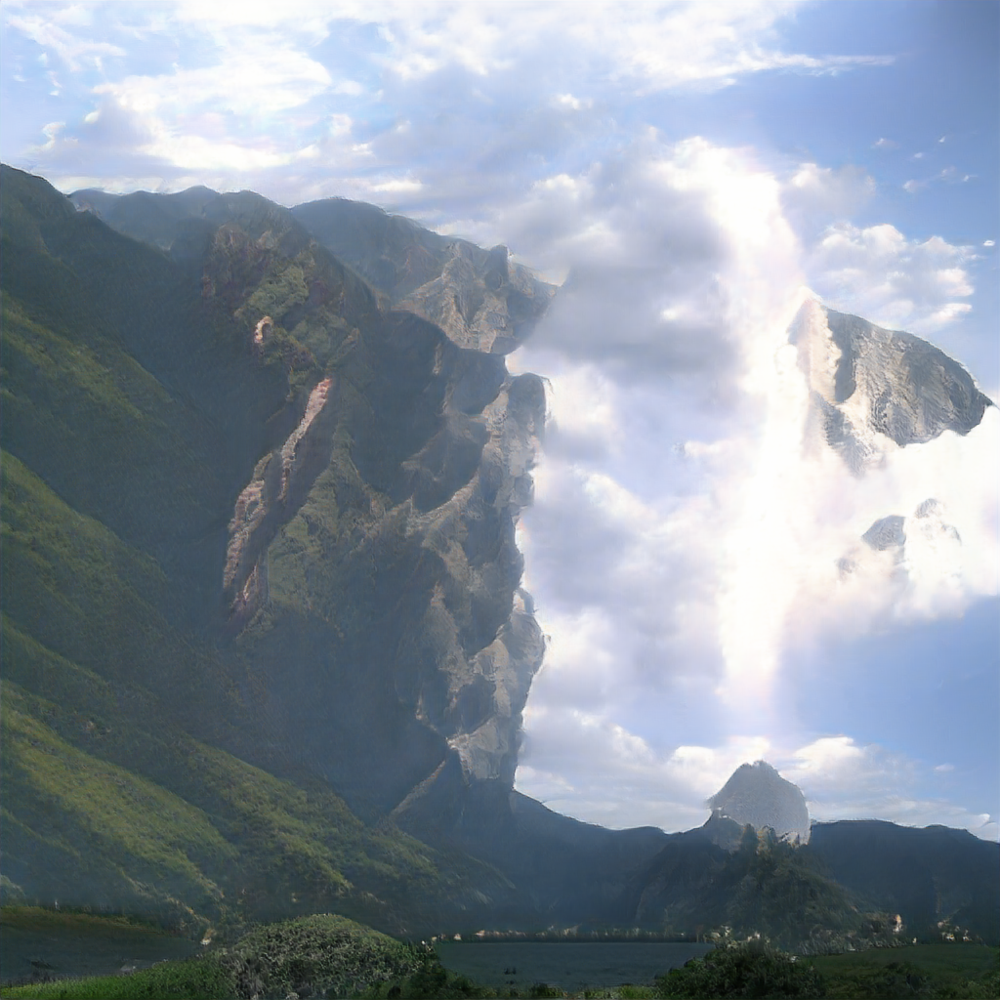

I started off in this direction because I was really interested in the abstract yet image-like output of BigGAN[^1].

However the small output size prevented it from being that interesting, so I wanted to see what I could do to "hack" it to output larger images (perhaps explaining something about how GANs generators work along the way).

In this post, I'll describe my process for generating weird images like this:



Since BigGAN already doesn't output realistic images, I was more concerned with making interesting images than improving image quality.

We're going to take the pretrained model (specifically the Generator, discarding the descriminator) of the BigGAN model and do something bit like [circuit-bending](https://en.wikipedia.org/wiki/Circuit_bending), modifying the code that produces an image **without** retraining the network (which is infeasible since the training data is proprietary to Google).

To more easily facilitate modification of the model, we're going to use the [PyTorch version](https://github.com/huggingface/pytorch-pretrained-BigGAN) provided by Huggingface.

The first step towards creating a larger image is finding a place within the model where we can replace a lower-resolution feature map with a higher-res map.

The general structure of BigGAN is as follows (assume 1 image is being generated):

- Inputs

  - **Class**: [1, 1000] one-hot vector indicating class,
    this vector is first embedded to a 128-dimensional space

  - **Z**: [1, 128] noise vector

- **Mapping** [1, 256] -> [1, 32768] -reshape-> [1, 4, 4, 128] <br />
  Convert the condition vector into an image (it will also be fed into the residual blacks)

Now we are dealing with an image in [N, H, W, C] format

The mapping network takes the 256 vector and outputs 32768 numbers that

1. **Residual Blocks** This is where the bulk of the convolution goes in the network. Each block is applied in sequence and has its own learned parameters.

2. **Non-local block** This is an "attention" mechanism to ensure that information propagates across the whole image

3. \*\* More non-local blocks

Here is the PyTorch function for hacking, cribbed from the [`BigGAN.forward(…)`](https://github.com/huggingface/pytorch-pretrained-BigGAN/blob/1e18aed2dff75db51428f13b940c38b923eb4a3d/pytorch_pretrained_biggan/model.py#L289) and [`Generator.forward(...)`](https://github.com/huggingface/pytorch-pretrained-BigGAN/blob/1e18aed2dff75db51428f13b940c38b923eb4a3d/pytorch_pretrained_biggan/model.py#L228) ) where you can see everything at a high level.

```py
def gen(noise_vector, class_vector, truncation):
  embed = model.embeddings(class_vector)
  cond_vector = torch.cat((noise_vector, embed), dim=1)

  gen = model.generator

  z = gen.gen_z(cond_vector)

  # Not shown: conversion to account for using Tensorflow weights instead of PyTorch weights

  for i, layer in enumerate(gen.layers):
    if isinstance(layer, GenBlock):
      # Residual block
      z = layer(z, cond_vector, truncation)
    else:
        # This is the self-attention layer
        z = layer(z)

  # Batch norm layer
  z = gen.bn(z, truncation)
  z = gen.relu(z)
  # Final convolution
  z = gen.conv_to_rgb(z)
  z = z[:, :3, ...]
  # Final activation
  z = gen.tanh(z)

  return z
```

Instead of calling the normal forward

Note: [a, b, c] denotes the shape of the multi-dimensional array aka "Tensor"

[^1]: 2018 A Brock, J Donahue, K Simonyan BigGAN [arXiv preprint](https://arxiv.org/abs/1809.11096) [Notebook](https://colab.research.google.com/github/tensorflow/hub/blob/master/examples/colab/biggan_generation_with_tf_hub.ipynb)
