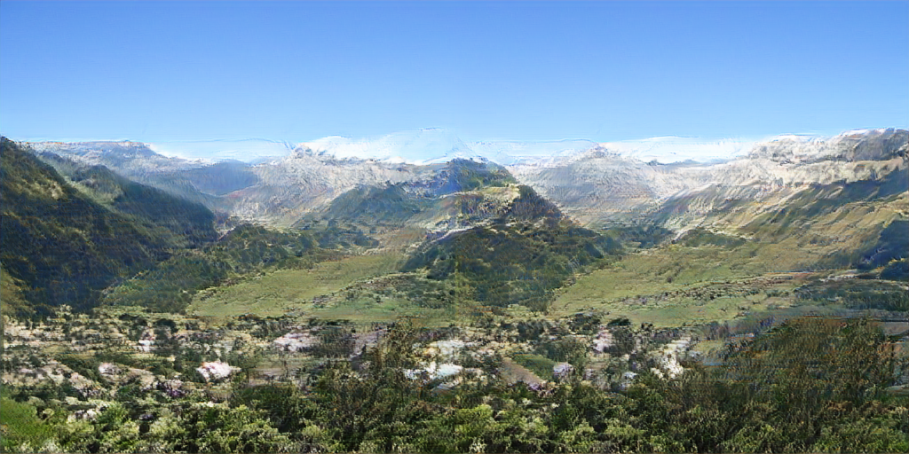

I started off in this direction because I was really interested in the abstract yet image-like output of BigGAN[^1]. You can see it in action over on [Artbreeder](https://artbreeder.com/), where it's called the "General" model.

[^1]: 2018 A Brock, J Donahue, K Simonyan BigGAN [arXiv preprint](https://arxiv.org/abs/1809.11096) [Notebook](https://colab.research.google.com/github/tensorflow/hub/blob/master/)

The limited, square output resolution of 512x512 felt pretty limiting, so I tried collaging the images together:


This made some progress, but the individual tiles are very apparent and it's hard to make a nice larger composition.

 wanted to see what I could do to "hack" BigGAN to output larger images directly. Perhaps this will explaini something about how GANs' generators work along the way.

In this post, I'll describe my process for generating weird images like this:


Since BigGAN already doesn't output realistic images, I was more concerned with making interesting images than improving image quality.

We're going to take the pretrained model (specifically the Generator, discarding the descriminator) of the BigGAN model and do something bit like [circuit-bending](https://en.wikipedia.org/wiki/Circuit_bending), modifying the code that produces an image **without** retraining the network (which is infeasible since the training data is proprietary to Google).

To more easily facilitate modification of the model, we're going to use the [PyTorch version](https://github.com/huggingface/pytorch-pretrained-BigGAN) provided by Huggingface.

The first step towards creating a larger image is finding a place within the model where we can replace a lower-resolution feature map with a higher-res map (hopefully subsequent layers will perform roughly the same function as before).

The general structure of BigGAN is as follows (assume 1 image is being generated):

1. **Inputs**

- **Class** [1, 1000][^2] one-hot vector indicating class,
  this vector is first embedded to a 128-dimensional space

For example, [0, 0, 1, 0, 0, 0, …] would correspond to class of _great white shark_

Nothing forces this vector to actually be one-hot (ie, have only one entry with a 1 and the rest 0), in fact most of the interesting images on Artbreeder are formed by a weird combination of partial classes.

For example, [this image](https://artbreeder.com/i?k=adf8ce01ceb55400ca688aa0) is 20% greenhouse, 18% web site, 15% band-aid, 11% nipple, 7% cell phone, etc.


During training, this vector is always one class only, so in-between images can be very glitchy!

[^2]: Note: [a, b, c] denotes the shape of the multi-dimensional array aka "Tensor"

- **Z** [1, 128] noise vector

  By varying this vector, you explore all of the different outputs associated with this class (or combination of classes)

2. **Mapping** [1, 256] -> [1, 32768] -reshape-> [1, 4, 4, 2048] <br />
   Convert the condition vector into an image (it will also be fed into the residual blocks)

   The mapping network takes the 256 vector and outputs a vector of 32768 numbers. Then this is interpreted as a 4x4 image with 2048 channels.

1. **Residual Blocks** This is where the bulk of the convolution goes in the network. Each block is applied in sequence and has its own learned parameters.
   Through the course of these residual blocks, the activations gain spatial resolution, ie the size goes up from 4x4 to 8x8, etc all the way up to 512x512.

1. **Non-Local Block** This is an "attention" mechanism to ensure that information propagates across the whole image

1. **More Residual Blocks** Same as above

1. **Output** A final convolution and activation is applied, resulting in a 3-channel image (Red, Green, Blue)

In code form (inside of blocks elided for clarity):

```
BigGAN(
  (embeddings): Linear(in_features=1000, out_features=128, bias=False)
  (generator): Generator(
    (gen_z): Linear(in_features=256, out_features=32768, bias=True)
    (layers): ModuleList(
      (0): GenBlock(…)
      (1): GenBlock(…)
      (2): GenBlock(…)
      (3): GenBlock(…)
      (4): GenBlock(…)
      (5): GenBlock(…)
      (6): GenBlock(…)
      (7): GenBlock(…)
      (8): SelfAttn(…)
      (9): GenBlock(…)
      (10): GenBlock(…)
      (11): GenBlock(…)
      (12): GenBlock(…)
      (13): GenBlock(…)
      (14): GenBlock(…)
    )
    (bn): BigGANBatchNorm()
    (relu): ReLU()
    (conv_to_rgb): Conv2d(128, 128, kernel_size=(3, 3), stride=(1, 1), padding=(1, 1))
    (tanh): Tanh()
  )
)
```

Here a PyTorch function for generating an image, cribbed from the [`BigGAN.forward(…)`](https://github.com/huggingface/pytorch-pretrained-BigGAN/blob/1e18aed2dff75db51428f13b940c38b923eb4a3d/pytorch_pretrained_biggan/model.py#L289) and [`Generator.forward(...)`](https://github.com/huggingface/pytorch-pretrained-BigGAN/blob/1e18aed2dff75db51428f13b940c38b923eb4a3d/pytorch_pretrained_biggan/model.py#L228) ) where you can see everything at a high level.

```python
model = BigGAN.from_pretrained('biggan-deep-512')
gen = model.generator

def gen(noise_vector, class_vector, truncation):
  embed = model.embeddings(class_vector)
  cond_vector = torch.cat((noise_vector, embed), dim=1)

  # Mapping
  z = gen.gen_z(cond_vector)
  # Treat vector as an image
  z = z.view(-1, 4, 4, 16 * gen.config.channel_width)
  # Not shown: conversion to account for using Tensorflow weights instead of PyTorch weights

  # Iterate over the layers, assigning the output of the previous layer to "z"
  for i, layer in enumerate(gen.layers):
    if isinstance(layer, GenBlock):
      # Residual block
      z = layer(z, cond_vector, truncation)
    else:
      # This is the self-attention layer
      z = layer(z)

  # Batch norm layer
  z = gen.bn(z, truncation)
  z = gen.relu(z)
  # Final convolution
  z = gen.conv_to_rgb(z)
  # For some reason TensorFlow weights output 8 channels instead of 3
  z = z[:, :3, ...]
  # Final activation
  z = gen.tanh(z)

  return z
```

We can now call this function to generate an image, though that's not interesting in itself.


What we really want to do is inject some code after one of the residual blocks, where we can apply our own up-scaling / manipulation / etc.

```python
…
  for i, layer in enumerate(gen.layers):
    if isinstance(layer, GenBlock):
      # Residual block
      z = layer(z, cond_vector, truncation)
    else:
      # This is the self-attention layer
      z = layer(z)
    if i == layer_to_hack:
      z = hack_layer(z)
…

def hack_layer(z):
  return z.repeat(1, 1, 2, 2)

```

<section id="results-tile">

### Tiling the image


<MultiImage>

  before
  
 
  after layer 0
  

  after layer 1
  

  after layer 3
  

  after layer 4
  

  after layer 5
  

  after layer 9
  

  after layer 11
  

  after layer 12
  

</MultiImage>

</section>

<section id="results-upscale">

### Upscaling the image x2

<MultiImage>

  Original output upscaled
  

  before layer 0
  

  after layer 0
  

  after layer 1
  

  after layer 3
  

  after layer 4
  

  after layer 5
  

  after layer 9
  

  after layer 11
  

  after layer 12
  

</MultiImage>

</section>


<section id="results-interp-reflect-mix">

### Tile + upscale

A mix of tiled and interpolation can help us fix the downsides of either

```python
def mixed(z):
  n, c, h, w = z.shape
  w_multiple = 2
  ww = w * w_multiple
  a = z.repeat(1, 1, 1, w_multiple)
  b = F.interpolate(z, size=(h, ww), mode='bilinear')
  return torch.min(a, b)
```

<MultiImage>

  before layer 0
  

  after layer 0
  

  after layer 1
  

  after layer 3
  

  after layer 4
  

  after layer 5
  

  after layer 7
  

  after layer 9
  

  after layer 10
  

  after layer 11
  

  after layer 12
  

</MultiImage>

</section>


<section id="results-interp-reflect-mix">

### Noise

What happens if we add noise to one of the activation images?

```python
def noise(z):
  amplitudes = 0.25 * z.std(dim=1)
  return z + amplitudes * torch.randn_like(z)
```

<MultiImage>

  original
  

  before layer 0
  

  after layer 0
  

  after layer 1
  

  after layer 3
  

  after layer 4
  

  after layer 5
  

  after layer 7
  

  after layer 9
  

  after layer 10
  

  after layer 11
  

  after layer 12
  

  after layer 13
  

</MultiImage>

</section>


<section id="results-noise-hard">
what about 4x as much noise?

```python
def noise(z):
  amplitudes = 2.0 * z.std(dim=1)
  return z + amplitudes * torch.randn_like(z)
```

<MultiImage>

  original
  

  before layer 0
  

  after layer 0
  

  after layer 1
  

  after layer 3
  

  after layer 4
  

  after layer 5
  

  after layer 7
  

  after layer 9
  

  after layer 10
  

  after layer 11
  

  after layer 12
  

  after layer 13
  

</MultiImage>

</section>